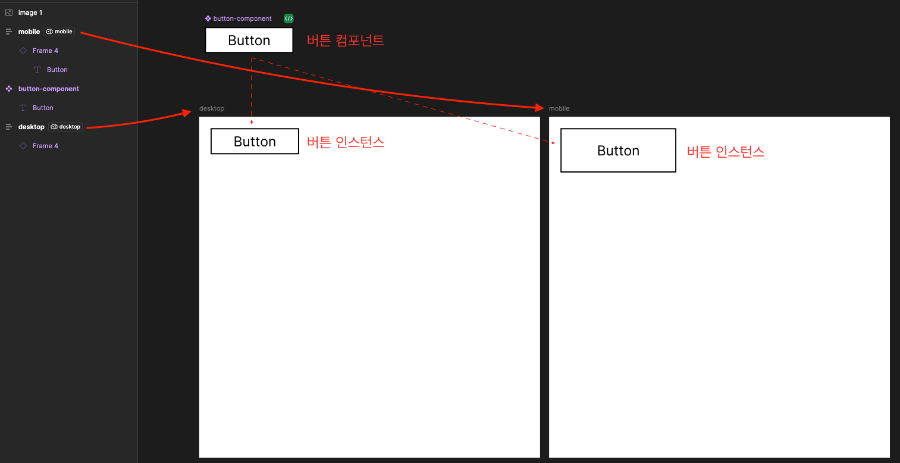

# Figma Variable(Token) "Mode" 
디자인 시스템 내에서 동일한 `시멘틱 토큰`을 사용해서, 각 디바이스를 대응할 수 있는 방법을 구상

**primitive token**
`시멘틱 토큰`에서 참조될 원시 값이다.


css variable로 변환하면 아래와 같은 결과가 되어야 한다.
```css
    --unit-04: 4px; // code syntax 를 사용한다면, 값이 아닌 추상화된 숫자가 들어갈 것이다. e.g. --unit-01
    --unit-12: 12px;
    --unit-20: 20px;
    --unit-32: 32px;
```

*tip. 피그마에서는 값으로만 검색이 가능해서, 디자이너의 편의를 위해 unit의 이름에 값 자체를 넣어주었지만, code syntax를 이용해서 이름을 변경해주는게 좋을 것 같다.*


**semantic token**
같은 `--spacing-01` 이지만, 디바이스에 따라서 다른 unit 값을 참조한다. 피그마에서는 `variable mode` 를 이용해서 설정이 가능하고, `layer` 에서 mode를 선택하면 부모 프레임에 따라서 내부 요소들의 토큰 값이 적용된다.


css variable로 변환하면 아래와 같은 결과가 되어야 한다.
```css
    body[data-device="mobile"] {
        --spacing-01: var(--unit-12); 
        --spacing-05: var(--unit-32);
    }

    body[data-device="desktop"] {
        --spacing-01: var(--unit-04);
        --spacing-05: var(--unit-20);
    }
```
설정된 피그마 베리어블(토큰)


각 프레임에 선택된 베리어블 모드


- 같은 `피그마 컴포넌트` 이지만, 각 인스턴스는 `부모 프레임`에 따라서 다른 패딩 값을 가진다.